# Pulse point Health App
- The Pulse Point Health Application is designed to fulfill multiple functions in the realm of health data management and analysis. Its core features include:
- Data Recording and Analysis: The application enables users to meticulously record their health data, facilitating comprehensive analysis through the integration of advanced Machine Learning algorithms.
- Integration with Health Tracking Applications: It seamlessly interfaces with various health tracking applications to collate diverse health-related metrics, consolidating them within its centralized server infrastructure.
- Continuous Data Processing: Employing Machine Learning models, the application rigorously processes user data at hourly intervals. This iterative analysis yields valuable insights and inferences pertaining to the user's health status.
- Facilitation of Professional Analysis: Health care professionals are provided access to the platform, enabling them to review and further analyze the compiled health data of users. This fosters informed decision-making and personalized healthcare interventions.
In essence, the Pulse Point Health Application serves as a comprehensive tool for individuals seeking to monitor and manage their health proactively, while also facilitating collaboration between users and healthcare professionals for enhanced care delivery.

# How to use our application
 - Firstly Download our Application
 - Register through signup portal by providing the information correctly
 - If you are a patient the please enter "Patient" and if you are a doctor then enter "Doctor"
    - Now login again with the credentials that you provide. (Don't worry its a single step process)
    - Now you will be redirected to the HomeScreen where you can see your data.
    - Click on Questions page to answer the questions for ML analysis.
        - Answer all the questions correctly
        - click on submit.
        - Your submission is recorded only when you see a Success popup.
    - Now go to analysis page from Menu bar
    - Here you will be able to see your details when ML analyzes your data.
 - if you are a Doctor, you will be directly redirected to the Dashboard where you can access different types of usr data.

# App ScreenShots
 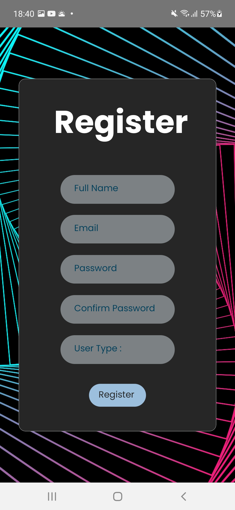 | 
 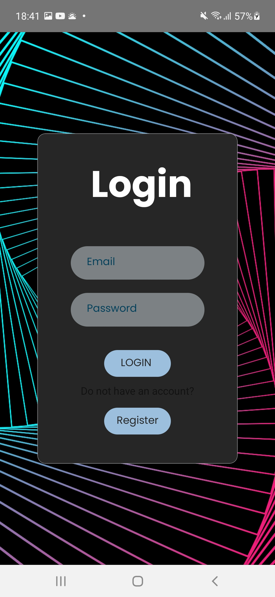 | 
 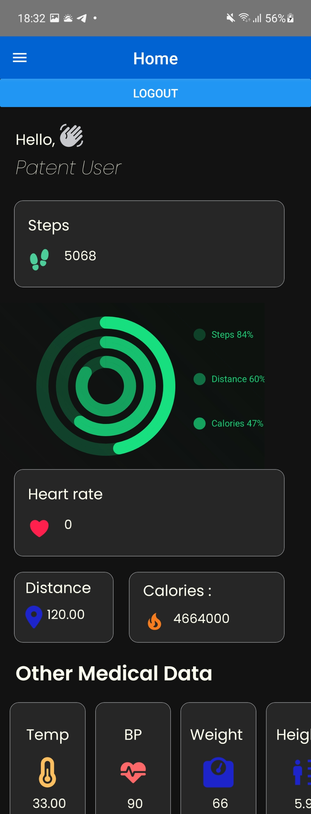
 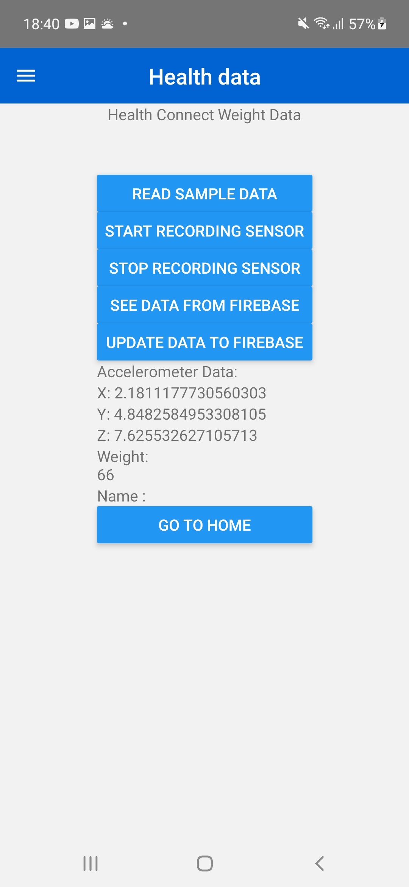 | 
 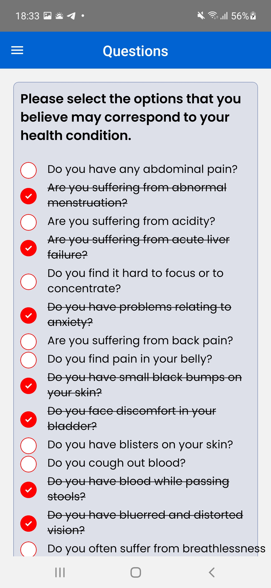 | 
 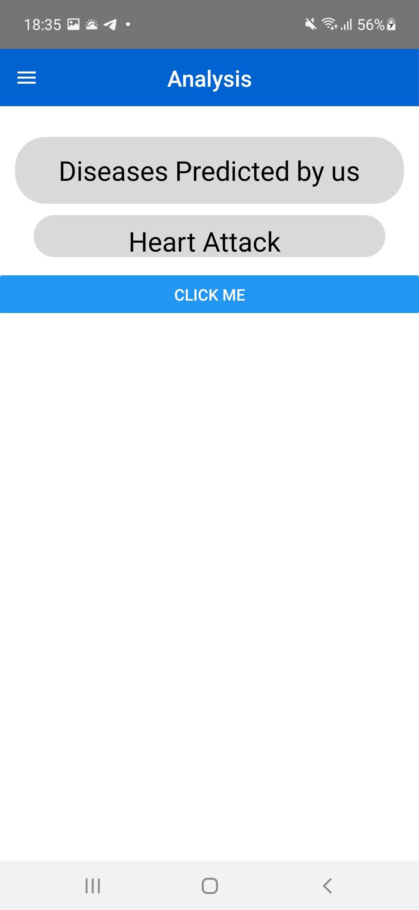
 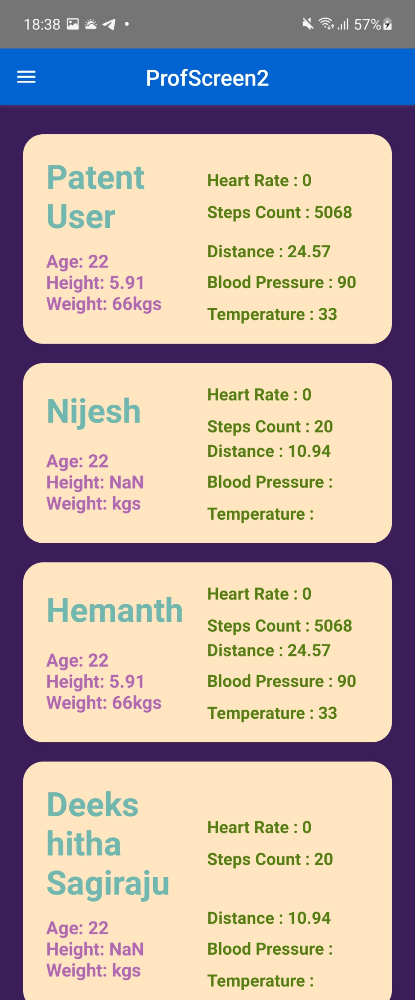 | 
 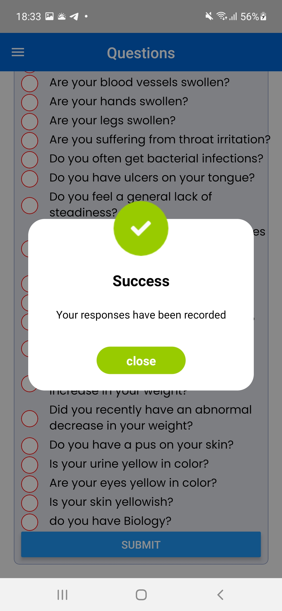 | 
 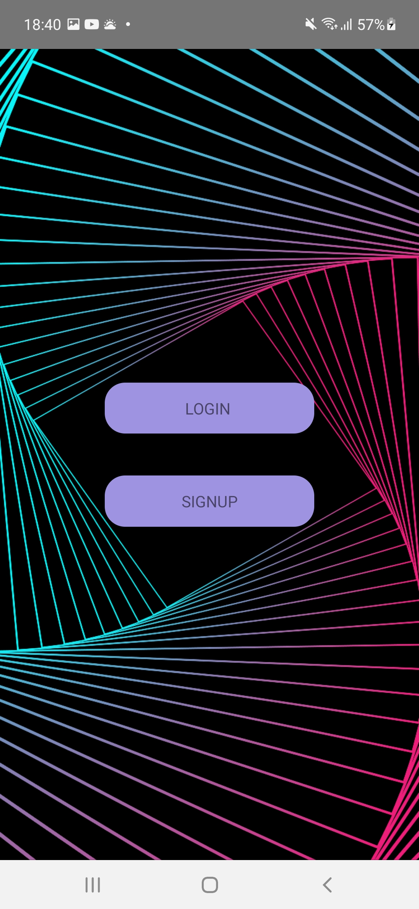

> # How to Run the code
> - first make sure that you have node, npm and react native CLI setup
> - and also make sure that you have Android studio setup.
> - Node installation
> ```
> sudo apt install nodejs
> ```
> - npm installation
> ```
> npm install -g npm
> ```
> - Open JDK installation
> ```
> https://openjdk.java.net/
> ```
> - (Android Studio installation) [https://developer.android.com/studio/index.html]
> - Now follow the below steps to run our App
> - Also now you can connect your physical mobile to the Desktop via usb cable. We prefer you to run this on Physical mobile.
> ```
> git clone https://github.com/DASS-Spring-2024/dass-project-spring-2024-team-30.git
> cd dass-project-spring-2024-team-30
> cd code
> cd healthy
> npm i
> npm start
> ```


[](https://classroom.github.com/online_ide?assignment_repo_id=13381867&assignment_repo_type=AssignmentRepo)

## Dataset links

`https://www.kaggle.com/datasets/arashnic/fitbit?resource=download` This is fitbit dataset 


# Code Usage Instructions
- Firstly Clone the github repo and go to code/healthy folder.
> ### Screens Modification
> - To modify the Specific screens, you can find screens folder in healthy directory.
> - Here you can modify any screen. For example if you want to change Greeting in HomeScreen,
>   - Goto `HomeScreen.js` and change the text "Hi"
>   - Now again run the code by executing npm start
-----------------------------------------------------------------
> ### Health connect data retrival Modification
> - You can see sampleread.ts. in function readSample, we are extracting the healthconnect data.
> - To change time duration, you can change `startTime_text` variable.
> - To Add more data fields, you just create a Hook and write readRecords() function for it to record data.
> - Now finally you can print that data where ever you want.
> - Homescreen refreshes data for every 10 secounds. To change this delay
>   - go to `Homescreen.js` change line 48.
--------------------------------------------------------------------
> ### Firebase Setup for Backend
> - To add your own backend as a service, first enable realtime database, Firestore and authentication in the (Firebase console)[https://console.firebase.google.com].
> - Now copy the data in `google-services.json` and paste in `android/app/google-services.json`
> - Now store the firebase app details in the `Components/config.jsx`
> - Now you can run the code and the data gets stored in your firebase database.
>   - User mailid and passwords are stored in Authentication. (You can change login method to google login / github login etc).
>   - User Additional data (designation etc during registration) are stored in the Firestore
>   - User health data is stored in realtime database. (ML uses this data for processing)

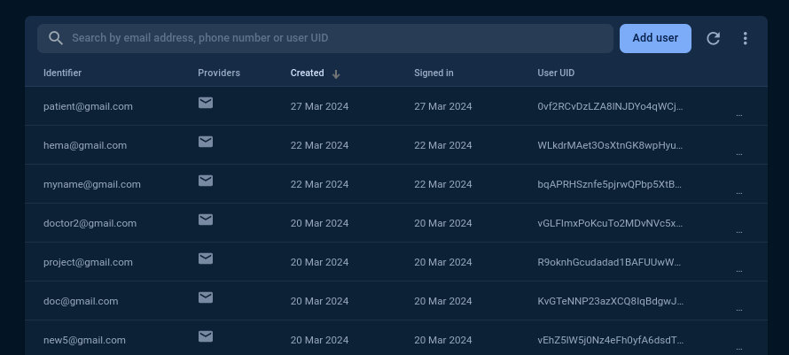
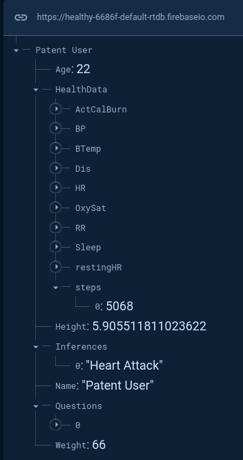
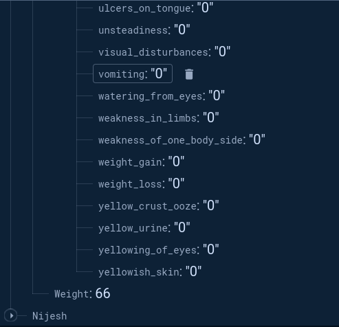
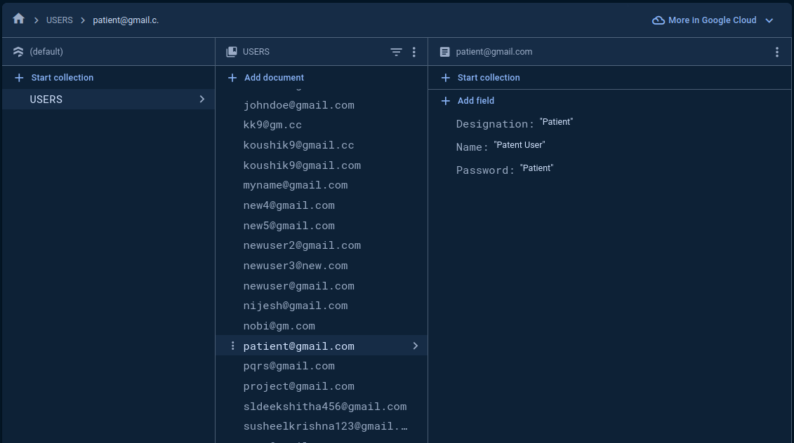
